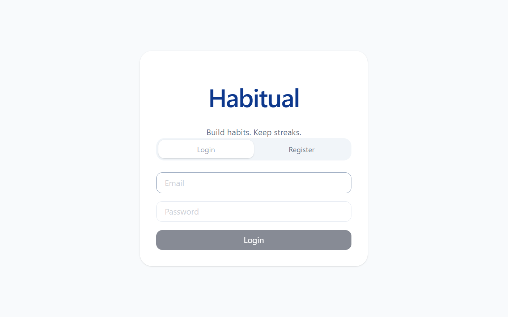
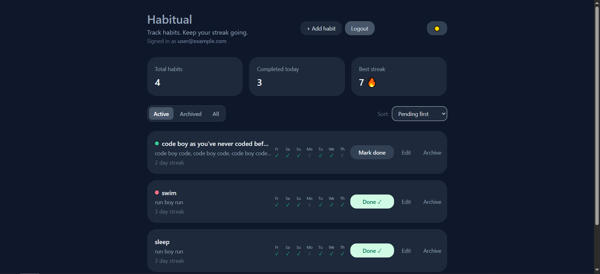
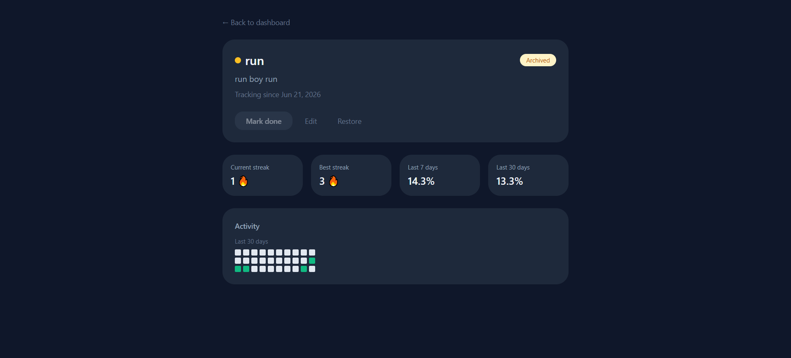

> React frontend for [Habitual API](https://github.com/Zhelero/habitual_api) — a habit tracking app with streak statistics and 30-day heatmap.


---

## Screenshots





---

## Features

- Login and registration with JWT authentication
- Auto-refresh of access token via refresh token rotation
- Dashboard with total habits, completed today, and best streak
- Habit CRUD — create, edit, archive / restore (no hard delete)
- Custom color per habit, shown on the dashboard and detail page
- 7-day activity strip on each dashboard habit card
- Filter habits by Active / Archived / All, with a dedicated empty state per filter
- Sort by pending, completed, streak, or alphabetically
- Mark habits as done / undo
- Dedicated habit detail page (`/habits/:id`) with full stats and a full-size 30-day heatmap
- Persisted dark mode, applied consistently across every route
- Filter and sort selection persisted in the URL (shareable, survives refresh, cleared on logout)
- Auto-dismissing success messages
- End-to-end test suite (Playwright) covering auth, habit CRUD, detail page, and color selection

---

## Tech Stack

| Layer      | Technology          |
|------------|---------------------|
| Framework  | React 18            |
| Routing    | React Router 7      |
| Build tool | Vite                |
| Styling    | Tailwind CSS        |
| Auth       | JWT (access + refresh tokens) |
| API client | fetch (native)      |
| State      | React Context + hooks |
| E2E testing | Playwright         |

---

## Routes

| Route          | Description                                              |
|----------------|-----------------------------------------------------------|
| `/`            | Dashboard — habit list, filters, sorting                  |
| `/habits/:id`  | Habit detail — streak/completion stats, heatmap, edit, archive |

Unauthenticated visitors are shown the login/register screen regardless of route.

---

## Project Structure
src/

├── components/

│   ├── HabitCard.jsx        # habit row on the dashboard list

│   ├── HabitForm.jsx        # create / edit form

│   ├── Heatmap.jsx          # 30-day activity heatmap

│   ├── ThemeToggle.jsx      # dark mode switch

│   ├── LoginForm.jsx        # login form

│   └── RegisterForm.jsx     # registration form

├── context/

│   └── AuthContext.jsx      # JWT storage and refresh logic

├── hooks/

│   ├── useHabits.js         # list + stats fetching for the dashboard

│   └── useHabit.js          # single habit + stats + heatmap for the detail page

├── utils/

│   ├── sortHabits.js

│   └── habitColors.js       # HABIT_COLORS palette + habitColorClass helper

├── AuthPage.jsx              # login / register screen

├── HabitualDashboard.jsx      # dashboard: list, filters, sorting

├── HabitDetailPage.jsx        # /habits/:id — full stats, heatmap, edit/archive

├── api.js                     # API client with auth headers

├── App.jsx                    # route definitions + dark mode state

└── main.jsx                   # React Router + AuthProvider setup

e2e/                          # Playwright end-to-end tests

├── auth.spec.js               # login / registration / token refresh

├── habits.spec.js             # habit CRUD, filters, sorting

├── habit-detail.spec.js       # detail page stats, edit, archive

├── habit-color.spec.js        # color picker and color persistence

├── fixtures.js                 # authedPage / registeredUser fixtures

├── helpers.js                  # shared test helpers (createHabitViaUI, uniqueEmail)

└── global-setup.js             # test environment bootstrap

---

## Getting Started

### Prerequisites

- Node.js 18+
- [Habitual API](https://github.com/Zhelero/habitual_api) running on `http://localhost:8000`

### Install and run

```bash
git clone https://github.com/Zhelero/habitual-ui
cd habitual-ui

npm install
npm run dev
```

UI will be available at `http://localhost:5173`

---

## Running E2E tests

```bash
npx playwright install   # first time only
npm run test:e2e
```

Tests run against a live API on `http://localhost:8000`, so make sure the backend is up first. Each test registers its own user, so runs are isolated from each other.

---

## Running the full stack

```bash
# Terminal 1 — API
cd habitual_api
uvicorn app.main:app --reload

# Terminal 2 — UI
cd habitual-ui
npm run dev
```

---

## Related

- [habitual_api](https://github.com/Zhelero/habitual_api) — FastAPI backend with PostgreSQL, JWT auth, and 98% test coverage